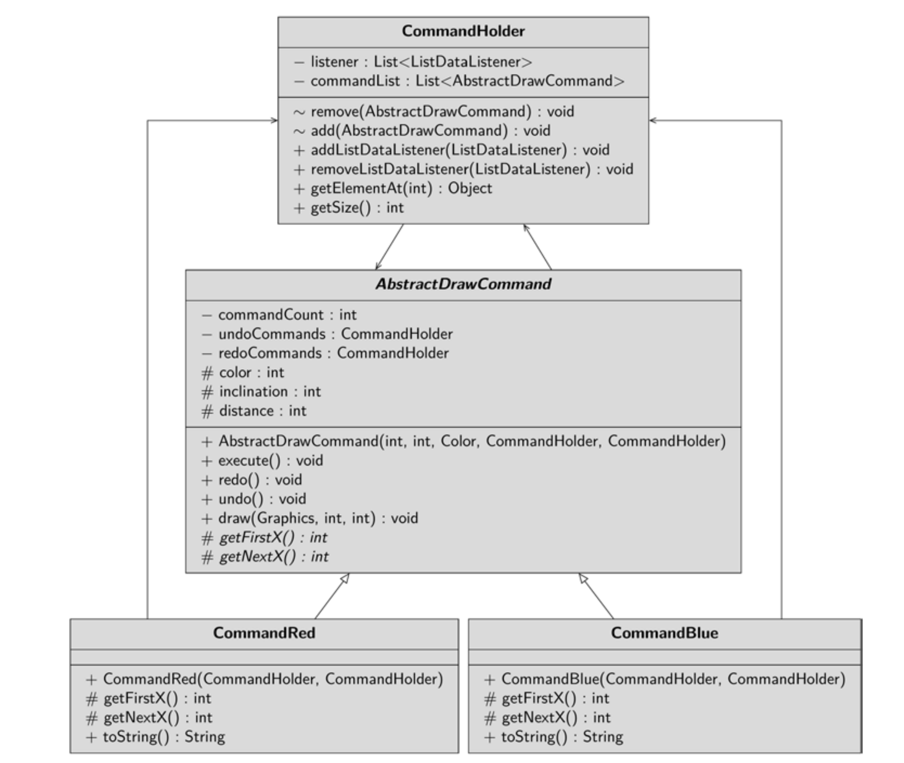

The Swing sample project demonstrates the undo and redo functionality. On the GUI of 
the application you will fnd four buttons. One button is labeled Red and one is labeled 
Blue. When you click one of these buttons, red or blue lines are painted on the canvas. The 
last command executed is appended to the end of the list on the left side. If you click the 
undo button, the last executed command is undone – deleted, that is. However, it is not 
actually deleted, but written to the list of commands to be restored on the right. If you click 
redo, the command is restored, which is equivalent to calling it again. If you select a com-
mand in the list on the left and click undo, the selected command is deleted. Likewise, if 
you highlight a command from the right-hand list and click redo, that exact command is 
restored. In Fig. 9.4, you can see what the GUI will look like. I have drawn a few lines and 
deleted them again.
The idea for this project goes back to James W. Cooper (Cooper, James William (2000): 
Java design patterns. A tutorial. Reading, Mass.: Addison-Wesley. ISBN 0201485397.).

There are two commands, the CommandBlue and the CommandRed. The Commands 
have partially the same code, which is outsourced to an abstract superclass 
AbstractDrawCommand. And fnally, you will fnd the CommandHolder class, 
where the commands are stored in the order they are processed. The invoker is the GUI.

The GUI class creates the components: a JPanel as a canvas on which the lines are 
painted, two JList instances that display the executed and the deleted commands. And 
fnally, on the GUI you will fnd four buttons, instances of the JButton class. The 
CommandHolder implements the ListModel interface, so it can be used as a model 
for the lists. The GUI class creates two CommandHolder instances, one for the undo list 
and one for the redo list, and passes both to the constructors of the CommandRed and 
CommandBlue commands.
 private fnal CommandHolder undoCommands =
 new CommandHolder();
 private fnal CommandHolder redoCommands =
 new CommandHolder();
 private AbstractDrawCommand cmdRed =
 new CommandRed(undoCommands, redoCommands);
 private AbstractDrawCommand cmdBlue =
 new CommandBlue(undoCommands, redoCommands);
When the btnRed button is activated, the execute() method of the CommandRed
class instance is called. This draws a red line on the canvas – the canvas object – and 
causes it to redraw itself.
 btnRed.addActionListener((ActionEvent evt) -> {
 cmdRed.execute();
 canvas.repaint();
 });
The listener for the btnBlue button looks likewise. Before I go into the listeners for 
undo and redo, I would like to take a closer look at the command classes.

The CommandRed and CommandBlue classes defne two different commands: One 
command draws a red line that slopes toward one direction, and the other command draws 
a blue line that slopes toward the other direction. In doing so, each command must perform 
two tasks: It must frst set the parameters for the lines, and it must also be able to draw its 
lines on the canvas as many times as it is called. The parameters of the line, i.e. color, 
distance and slope, are stored in the subclasses. The superclass holds in a non-static data 
feld the information about how many times the command has been called.
If the execute method is now called, the counter is frst incremented. Then a reference 
to the command is passed to the CommandHolder, which stores all commands in the 
order they are called. When the lines are to be drawn, the canvas passes a reference to its 
Graphics instance, the pen, to the command and causes it to draw as many lines as it has 
been called.

To the right and left of the canvas you see two lists in which the commands are stored one 
after the other. You can select any command object and call the undo command on it. The 
logic of undo is defned in the command itself. The command decrements its counter, 
clears itself from the undo list, and writes itself to the redo list – admittedly, unlike the 
tasks of real projects, this logic is very simple. When you initiate a redo, the command is 
deleted from the redo list and then executed again, i.e. the execute method is called.