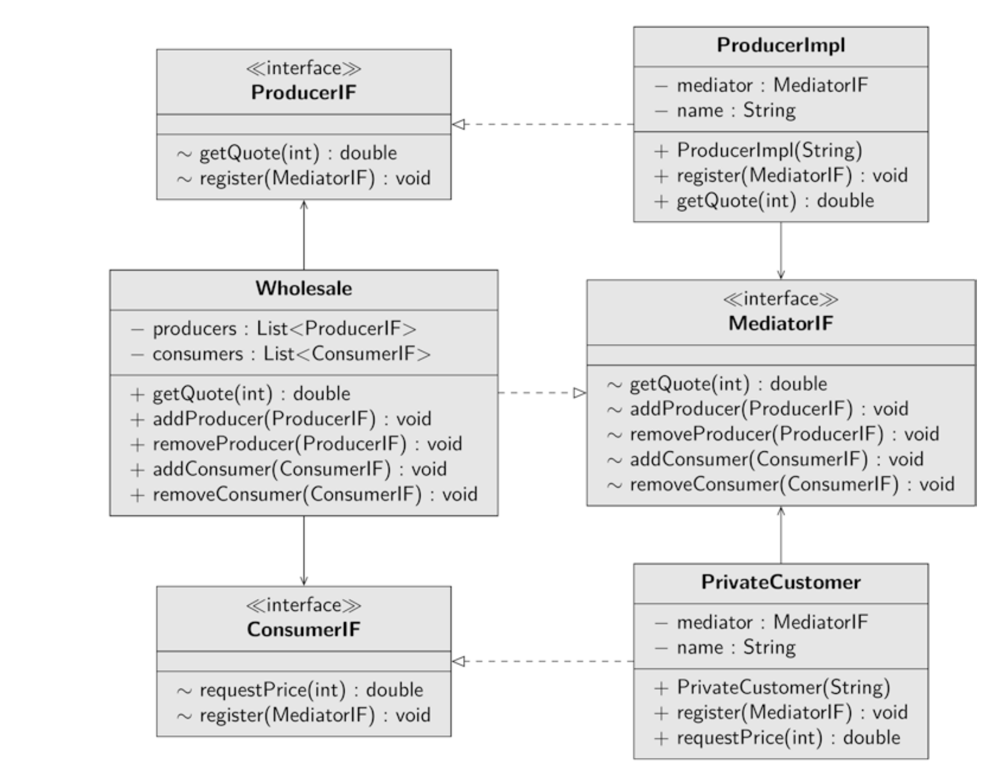

The following simulation shows you the mediator in action. You have one unit that produces wine; this unit is a simplified producer, in reality winemakers, cooper and the glycol
industry are behind this unit. Another unit represents costumers or retailers, the consumers. Consumers buy wine at the respective low price. Since there are x consumers and y
producers, the dependencies are reduced to the middleman, the mediator. The mediator
receives the consumer’s requests and forwards them to the producers. Finally, the producers tell the mediator what price they want; the mediator forwards this information to the
consumers. In addition to a method for negotiating the price, the mediator needs other
methods for registering and unregistering consumers and producers
