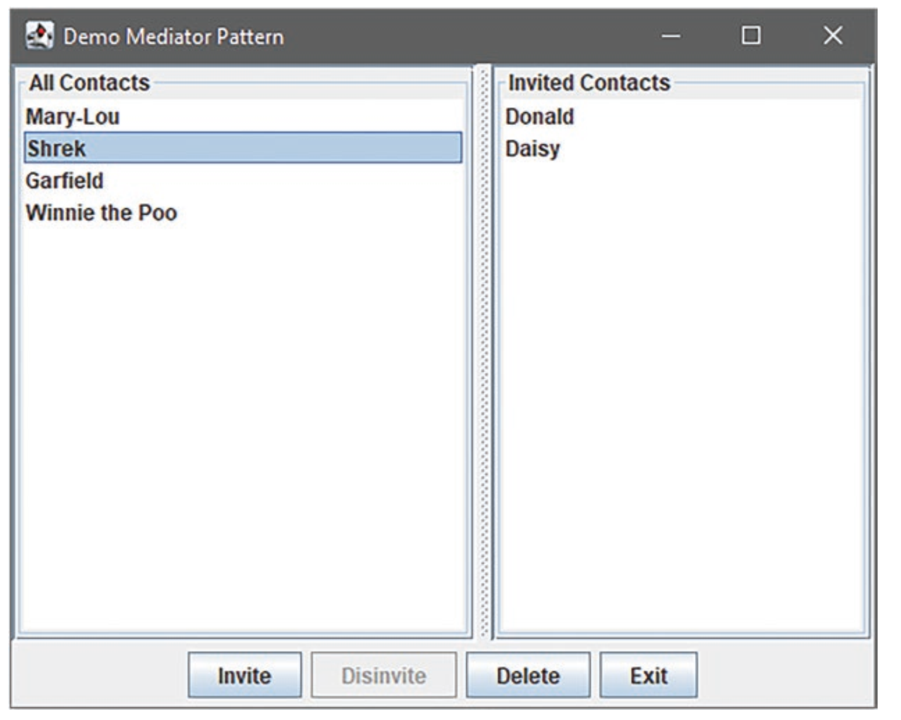

The mediator pattern is also very common in the implementation of user interfaces. In the
model-view-controller model, the controller is precisely the mediator that mediates
between the view/use and the abstract model of an application

You have a GUI that shows two lists. The left list shows all contacts in your address book;
the right lists all contacts who will be invited to the next party. For this example, we need
four buttons. One button moves a contact to the list of invited contacts, another button
moves a contact back to the general list of all contacts. A third button deletes a selected
contact and the fourth button exits the program

Various dependencies are to be defined:
* The Exit button is always activated, regardless of the dependencies described below. If
you click on it, the program is terminated.
* If a contact is marked on the right list, the button Do not invite is activated. Clicking this
button moves the contact to the left list.
* If a contact is selected on the left list, the Invite button is activated.
* When the user clicks on this button, the selected contact is moved to the right list.
* Only one contact can be selected in both lists.
* The Delete button is activated when an entry is selected in one of the lists.
* If no contact is selected – neither in the right nor in the left list – no button – except
Exit – is activated.
* When a contact has been moved or deleted, all markers are cleared and all buttons are
disabled except for the Exit button.

# Structure of the GUI
The two lists are
instances of the class JList. The four buttons are instances of the class JButton. All
components register with an instance of the class Mediator, which is the core of the project. It stores references to all components involved. It also defines methods that are called
when an event is fired. Let’s look at the flow using the Invite button as an example. When
the Invite button is activated, the Invite() method of the Mediator is called. Within this
class, all the buttons – except for the exit button – are first disabled. Then the method gets
the models of the two JList instances and moves the selected entry into the list of
invited contacts.