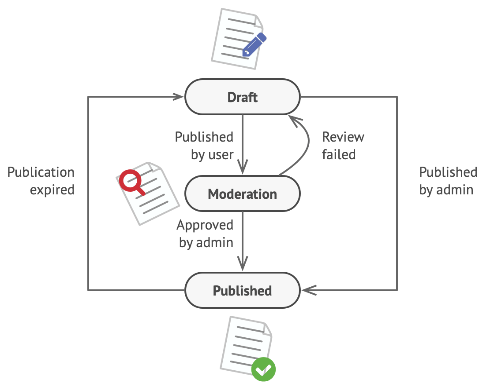
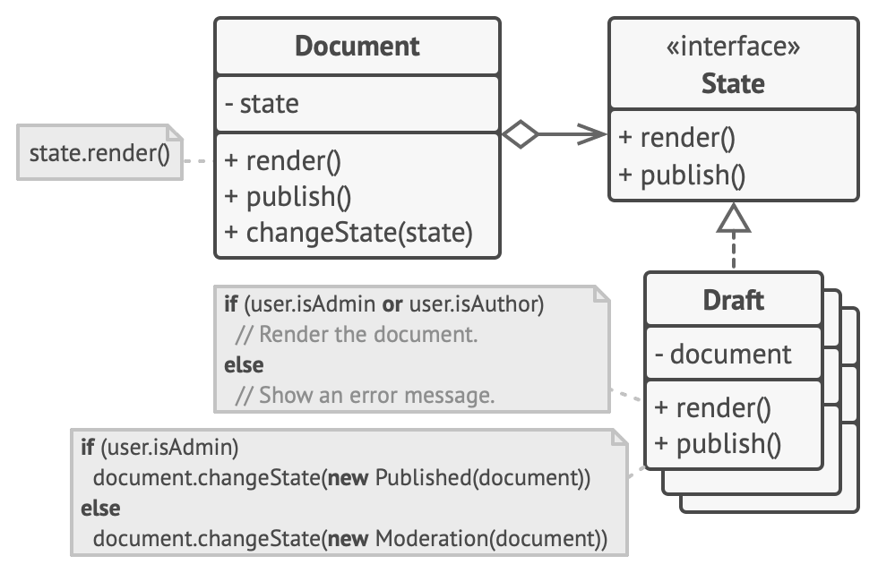

 Imagine that we have a Document class. A document can be in one of three states: Draft, Moderation and Published. The publish method of the document works a little bit differently in each state:

* In Draft, it moves the document to moderation.
* In Moderation, it makes the document public, but only if the current user is an administrator.
* In Published, it doesn’t do anything at all.


State machines are usually implemented with lots of conditional statements (if or switch) that select the appropriate behavior depending on the current state of the object. Usually, this “state” is just a set of values of the object’s fields. Even if you’ve never heard about finite-state machines before, you’ve probably implemented a state at least once. Does the following code structure ring a bell?
```
class Document is
    field state: string
    // ...
    method publish() is
        switch (state)
            "draft":
                state = "moderation"
                break
            "moderation":
                if (currentUser.role == "admin")
                    state = "published"
                break
            "published":
                // Do nothing.
                break
    // ...
```
The biggest weakness of a state machine based on conditionals reveals itself once we start adding more and more states and state-dependent behaviors to the Document class. Most methods will contain monstrous conditionals that pick the proper behavior of a method according to the current state. Code like this is very difficult to maintain because any change to the transition logic may require changing state conditionals in every method.

The problem tends to get bigger as a project evolves. It’s quite difficult to predict all possible states and transitions at the design stage. Hence, a lean state machine built with a limited set of conditionals can grow into a bloated mess over time.

#Solution
The State pattern suggests that you create new classes for all possible states of an object and extract all state-specific behaviors into these classes.

Instead of implementing all behaviors on its own, the original object, called context, stores a reference to one of the state objects that represents its current state, and delegates all the state-related work to that object.



To transition the context into another state, replace the active state object with another object that represents that new state. This is possible only if all state classes follow the same interface and the context itself works with these objects through that interface.