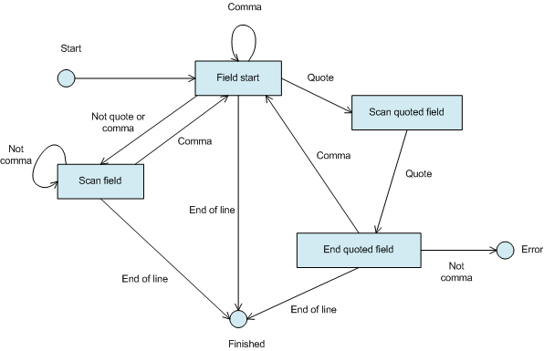

https://sourcemaking.com/design_patterns/state/delphi

This session consists of the development of a small application to read and pretty-print XML and CSV files. Along the way, we explain and demonstrate the use of the following patterns: State, Interpreter, Visitor, Strategy, Command, Memento, and Facade.

Allow an object to alter its behaviour when its internal state changes. The object will appear to change its class
The State pattern is used when an object's behaviour changes at run-time depending on its state. Indicators of the potential for using the pattern are long case statements or lists of conditional statements (the Switch Statements "bad smell", to use refactoring parlance). In Delphi (as in most languages) a given object cannot actually change its class, so we have to use other schemes to mimic that behaviour, as we shall see.

The participants in an implementation are the context and the states. The context is the interface presented to clients of the subsystem being modelled by the State pattern. In our case this will be the TCsvParser class. Clients will never see the states, allowing us to change them at will. The only interface client subsystems are interested in is extracting the fields from a line of text.

We do this by using a finite state machine (FSM). Essentially, an FSM is a model of a set of states. From each state, particular inputs can cause transitions to other states. There are two sorts of special states. The Start state is the state the FSM is in before beginning work. End states are those where the processing finishes, and are usually denoted by double circles. The FSM for the parser is shown below:


In the State pattern, each of the states becomes a subclass of the base state class. Each subclass must implement the abstract method ProcessChar which handles the input character and decides on the next state.

# Implementation
The interface section source code for the State pattern code to parse CSV files is:
```delphi
unit CsvParser;

interface
uses Classes;

type

  TCsvParser = class;  // Forward declaration
  TParserStateClass = class of TCsvParserState;

  TCsvParserState = class(TObject)
  private
    FParser : TCsvParser;

    procedure ChangeState(NewState : TParserStateClass);
    procedure AddCharToCurrField(Ch : Char);
    procedure AddCurrFieldToList;
  public
    constructor Create(AParser : TCsvParser);
    procedure ProcessChar(Ch : AnsiChar;Pos : Integer); virtual; abstract;
  end;
 
  TCsvParserFieldStartState = class(TCsvParserState)
  private
  public
    procedure ProcessChar(Ch : AnsiChar;Pos : Integer); override;
  end;
 
  TCsvParserScanFieldState = class(TCsvParserState)
  private
  public
    procedure ProcessChar(Ch : AnsiChar;Pos : Integer); override;
  end;
 
  TCsvParserScanQuotedState = class(TCsvParserState)
  private
  public
    procedure ProcessChar(Ch : AnsiChar;Pos : Integer); override;
  end;
 
  TCsvParserEndQuotedState = class(TCsvParserState)
  private
  public
    procedure ProcessChar(Ch : AnsiChar;Pos : Integer); override;
  end;
 
  TCsvParserGotErrorState = class(TCsvParserState)
  private
  public
    procedure ProcessChar(Ch : AnsiChar;Pos : Integer); override;
  end;

  TCsvParser = class(TObject)
  private
    FState           : TCsvParserState;
    // Cache state objects for greater performance
    FFieldStartState : TCsvParserFieldStartState;
    FScanFieldState  : TCsvParserScanFieldState;
    FScanQuotedState : TCsvParserScanQuotedState;
    FEndQuotedState  : TCsvParserEndQuotedState;
    FGotErrorState   : TCsvParserGotErrorState;
    // Fields used during parsing
    FCurrField       : string;
    FFieldList       : TStrings;

    function GetState : TParserStateClass;
    procedure SetState(const Value : TParserStateClass);
  protected
    procedure AddCharToCurrField(Ch : Char);
    procedure AddCurrFieldToList;
    property  State : TParserStateClass read GetState write SetState;
  public
    constructor Create;
    destructor  Destroy; override;

    procedure ExtractFields(const s : string;AFieldList : TStrings);
  published
  end;
  ```
If we examine the parser class first, we see that we have a private instance of each of the state subclasses. In our case, where we could be parsing very long files, and the state is changing frequently, it makes sense to create all the objects once, and keep track of the current state.

If you have a situation where you have very many states (which is when this pattern really starts making a difference), especially if they are only needed occasionally, then it makes more sense to create and free the states on the fly. This might be an opportunity to use the automatic garbage collection property of interfaces, but be careful not to mix class and interface access to the state objects. It might also be a time to consider the Flyweight pattern (I'm going to refer you to the GoF for that).

Note that we are keeping track of the state using the class of the current state object. We can use a protected property (an example of the Self Encapsulate Field refactoring, as it happens) to access the field. The parser class also keeps the current field and the list of extracted fields. The states will use the protected methods to update them.

The states can manage this because the parser is passed as a parameter in the constructor. It is quite common for state objects to need access to the context in which they are being used. The base abstract state class defines methods for changing state, and updating the parser. Descendant classes only need to implement the character processing routine.

Let's have a look at one of these routines, for the start state.
```delphi
procedure TCsvParserFieldStartState.ProcessChar(Ch : AnsiChar;Pos : Integer);
begin
  case Ch of
    '"' : ChangeState(TCsvParserScanQuotedState);
    ',' : AddCurrFieldToList;
  else
    AddCharToCurrField(Ch);
    ChangeState(TCsvParserScanFieldState);
  end;
end;
```
If we get a double quote, then the FSM goes into the Scan Quoted state, a comma means we have come to the end of the field, so we should add it to the list, and anything else means we are starting a new field.

However, in the Scan Quoted state shown below, the transition when we get a double quote is different. This is what we mean by the behaviour depending on the state.
```delphi
procedure TCsvParserScanQuotedState.ProcessChar(Ch : AnsiChar;Pos : Integer);
begin
  if (Ch = '"') then begin
    ChangeState(TCsvParserEndQuotedState);
  end else begin
    AddCharToCurrField(Ch);
  end;
end;
```
The rest of the code is quite straightforward. The only slightly different state is the Error state, where we raise an exception. The parser has one long method, only because it has to handle validity checks, setting up, and so on. The essential lines of ExtractFields are:
```delphi
  // Read through all the characters in the string
  for i := 1 to Length(s) do begin
    // Get the next character
    Ch := s[i];
    FState.ProcessChar(Ch,i);
  end;
```
This reads through the input line s, sending each character to the current state. Some sort of processing loop like this is not uncommon.