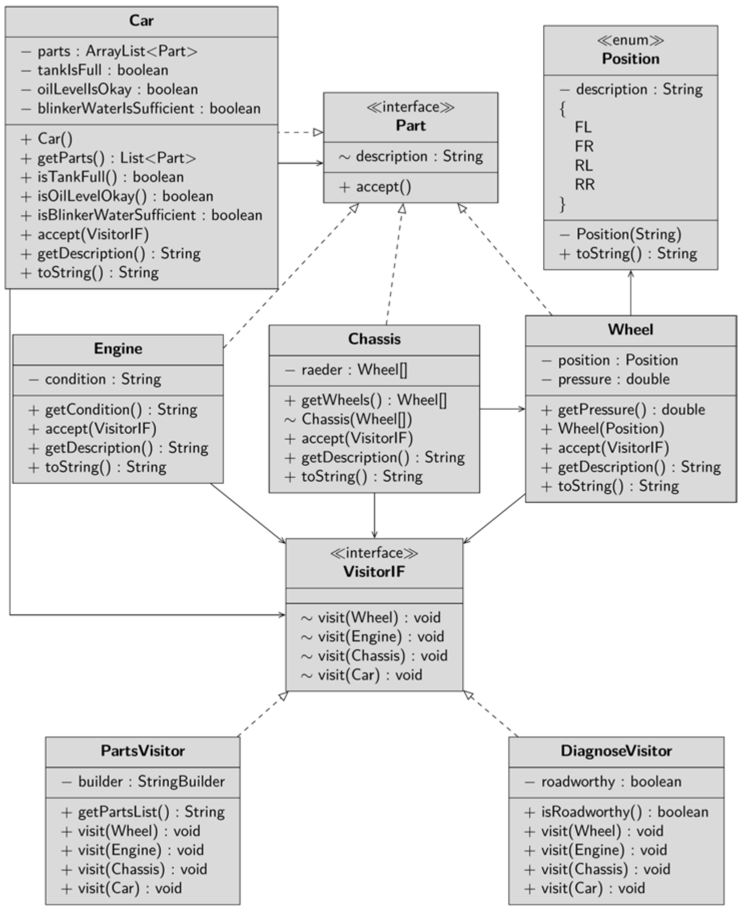

A car is an aggregate; it consists of wheels, an engine and the chassis. The car as well as 
its components are grouped under the interface Element.

 Besides, the 
methods getDescription() and accept() are prescribed in the interface. One 
method will return a short description, the other will provide an interface for a Visitor 
object. Take the Wheel class as an example. The wheel can store its position – for exam-
ple, front left. It can also store and return the air pressure. The accept() method is 
overridden so that the visit() method is called on the Visitor object passed in, and 
passing over its own instance – this.

    public class Wheel implements Element {
    private fnal Position position;
    private fnal double pressure = 2.0;
    public double getPressure() {
    return pressure;
    }
    public wheel(Position position) {
    this.position = position;
    }
    @Override
    public void accept(VisitorIF visitor) {
    visitor.visit(this);
    }
    @Override
    public String getDescription() {
    return “- Wheel “ + position;
    }
 }

On the chassis, the wheels are mounted. When the accept method is called on it, in the 
frst step it calls the visit method on the Visitor and passes itself as a parameter. In the 
second step, the visit method is called for each wheel.

    public class Chassis implements Element {
    private fnal wheel[] wheels;
    public Rad[] getWheels() {
    return wheels;
    }
    Chassis(wheel[] wheels) {
    this.wheels = wheels;
    }
    @Override
    public void accept(VisitorIF visitor) {
    visitor.visit(this);
    for (var wheel : wheels)
    wheel.accept(visitor);
    }
    @Override
    public String getDescription() {
    return “- Chassis“;
    }
    }

The car should also still be described in the required brevity. It stores the infor-
mation whether the tank is full, whether there is enough oil and whether blinker 
water (this innovative concoction is here representative for any other possible con-
sumption liquid) was refilled. There are corresponding access methods to these 
attributes. The constructor installs a new engine, creates the chassis and attaches 
the wheels to it.

    public class Car implements Element {
    private fnal List<Element> parts =
    new ArrayList<>();
    // … abridged
    public Car() {
    parts.add(new Engine());
    parts.add(new Chassis(new Wheel[] {
    new Wheel(Position.FL),
    new Wheel(Position.FR),
    new Wheel(Position.RL),
    new Wheel(Position.RR)
    }));
    }
    }

The accept() method calls each component’s visit method and passes them a refer-
ence to the visitor. Then the visit method is called on the Visitor and the car passes itself 
over as a parameter. I won’t print the Engine class here – it follows the same logic as the 
previous classes.
## The Visitor
A visitor is 
described by the interface VisitorIF. Every class that should be able to act as a visitor 
must override the methods declared in it; this concerns the method visit(), which is 
overloaded four times, once for each element.

A concrete Visitor is the PartsVisitor. It compiles a list of the descriptions of all 
parts. To do this, it overwrites the method visit() so that the method getDescrip-
tion() is called on the parameter passed, i.e. a wheel, an engine, a chassis or a car. The 
descriptions of all the individual parts are combined by a StringBuilder. The method get-
Parts() returns a string with the list of all parts.

    public class PartsVisitor implements VisitorIF {
    private fnal StringBuilder builder =
    new StringBuilder();
    public String getPartsList() {
    return “Components: \n“ + builder.toString();
    }
    @Override
    public void visit(Wheel wheel) {
    builder.append(wheel.getDescription()).
    append(“\n“);
    }
    @Override
    public void visit(Engine engine) {
    builder.append(engine.getDescription()).
    append(“\n“);
    }
    // … abridged
    }
    The Visitor inheritance hierarchy is tightly bound to the Element classes. It must 
    have precise knowledge of the interfaces of the objects to be visited, as you will see 
    in a moment. Conversely, the element classes only need to know the Visitor interface.
    public interface VisitorIF {
    void visit(wheel wheel);
    void visit(Engine engine);
    void visit(Chassis chassis);
    void visit(Car car);
    }
## The Client
The client creates an instance of the Auto class and a component Visitor. It then calls the 
accept() method with the Visitor as a parameter. The resulting string is output to the 
console.

    public class ApplStart {
    public static void main(String[] args) {
    var car = new Car();
    var visitor = new PartsVisitor();
    car.accept(visitor);
    var parts = visitor.getPartsList();
    System.out.println(parts);
    // … abridged
    }
    }
## DiagnoseVisitor
When you drive to the workshop because of an irregularity on your vehicle, a person there 
hooks up a diagnostic device to a defned interface in the car and can shortly afterwards 
say precisely whether the car has a defect, and if so, in which element. This situation is 
mapped by the DiagnoseVisitor. It works very similarly to the Component Visitor. It que-
ries certain information on each element and evaluates it. There are two different proce-
dures. The car can measure by itself if the tank is full and if the oil level is correct; therefore, 
it returns a boolean value with the appropriate access methods. I assume that very few cars 
measure the air pressure in their tires independently, although this is technically possible. 

Here the visitor gets the current value and evaluates it. At the end it can give information 
whether the car is ready to drive. Please analyze the DiagnoseVisitor independently – the 
class is not complicated.

