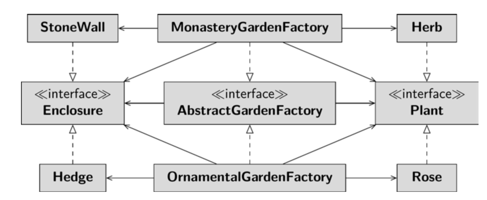

# Create Gardens

Source: Book Olaf Musch - Design Patterns with Java_ An Introduction-Springer Vieweg (2023)

In our example there are different types of gardens; frst we have monastery gardens where 
herbs are planted. But there are also ornamental gardens where roses grow. The respective 
enclosure is different, of course. The monastery garden is surrounded by a stone wall, 
while the ornamental garden is framed by a nicely cut hedge. The ground is also different 
in each case: in the monastery garden there are stone slabs, while in the ornamental garden 
you walk on fresh grass. The monastery garden and the ornamental garden are therefore 
two different product families. Each product family has the same characteristics (plants, 
fencing, soil), but each has a different design; the respective characteristics are called 
products in the abstract factory.

# Trial1
You can guess that this approach seems somehow wrong. But why are you bothered by 
it? Quite simply: You have three methods in which a switch query is needed. If you want 
to create another garden  – for example a kitchen garden with tomatoes  – you have to 
change a switch query in three methods. This is not very maintenance-friendly, but all the 
more error-prone.

The garden certainly also needs to be managed: The plants want to be watered and 
pruned; you also need to weed regularly. I will not print the methods for managing the 
garden here. However, you have a violation of the Single Responsibility Principle here: 
you put the creation of the garden and its maintenance into one class. True, I had written 
that it is okay to violate it if you are aware of it and have a good reason. But that good 
reason is exactly what is missing here. Violating the SRP could be problematic, though, 
because both creating and managing the garden are very costly; these two tasks had better 
not be mixed. So the approach above implements a lot of code in a single class that, in case 
of doubt, is not needed at all. If you redefne a responsibility, both responsibilities need to 
be retested. Neither of the responsibilities can be reused. Here, the cohesion is decidedly 
weak and that is an indication of inappropriate design.

# Trial2
Perhaps the problem would be solved if you used inheritance? In the Trial2 package, you 
defne an abstract class AbstractGarden, from which the subclasses 
MonasteryGarden, KitchenGarden, or OrnamentalGarden inherit. The garden is created in the constructor of the subclass.
```java
 public class MonasteryGarden extends AbstractGarden {
 MonasteryGarden() {
 super.layFloor(new OldStonePlate());
 super.plant(new Herbs());
 super.enclose(new StoneWall());
 }
 }
 ```
This solution looks cleaner, but in fact it doesn’t solve the dual responsibility problem: 
you still have an object that lavishly creates the garden and manages it. Moreover, this 
approach violates a principle that I consider much more essential than the SRP: prefer 
composition to inheritance. So let’s fnd an alternative!

# Trial2
In the Trial3 package you have different gardens (product families) each with different 
products, i.e. different types of plants, soil types and enclosures. The products vary and are 
now encapsulated. I mentioned earlier that it makes sense to program against interfaces. 
This gives you the greatest possible fexibility. How can the products be abstracted? Both 
herbs and roses are plants; both the stone wall and the hedge are enclosures; both the fag-
stones and the lawn are soil. So design the interfaces, the different abstract products, and 
the implementations, the different concrete products.

The abstract garden factory knows the abstract declaration of the individual products, 
i.e., the interfaces foor, enclosure and plant. The client creates a variable of the abstract 
factory type that references an instance of a concrete factory: AbstractGardenFactory 
factory = new OrnamentalGardenFactory(). The concrete factory knows its 
specifc products: In the example, the ornamental garden knows only the lawn, rose, and 
hedge – it has no reference to the fagstones, herb, or stone wall. When the client requests 
foor, plants, and enclosure, the factory is able to return its special products. Since the client 
relies on abstractions, i.e. the interfaces, it has no idea what specifc products it will receive – 
and thanks to polymorphism, it doesn’t have to worry about the runtime type of the object.
The client is free to instantiate a different factory and thus be given completely different 
products. A single line of code changes the nature of the garden:
```java
 AbstractGardenFactory factory =
 new MonasteryGardenFactory();
```
The client is independent of changes to existing factories. If lilies are to be planted in 
the ornamental garden instead of roses, this change can be made in the 
OrnamentalGardenFactory; the client will not even notice this change, it does not 
have to be tested again.

With this solution, you ensure that the garden is consistent. You purchase the individual 
products from a specifc factory. The factory uniformly supplies only products for either a 
monastery garden or an ornamental garden. The gardens are now consistent; it is ensured that 
no roses grow in the monastery garden and no herbs are planted in the ornamental garden.
