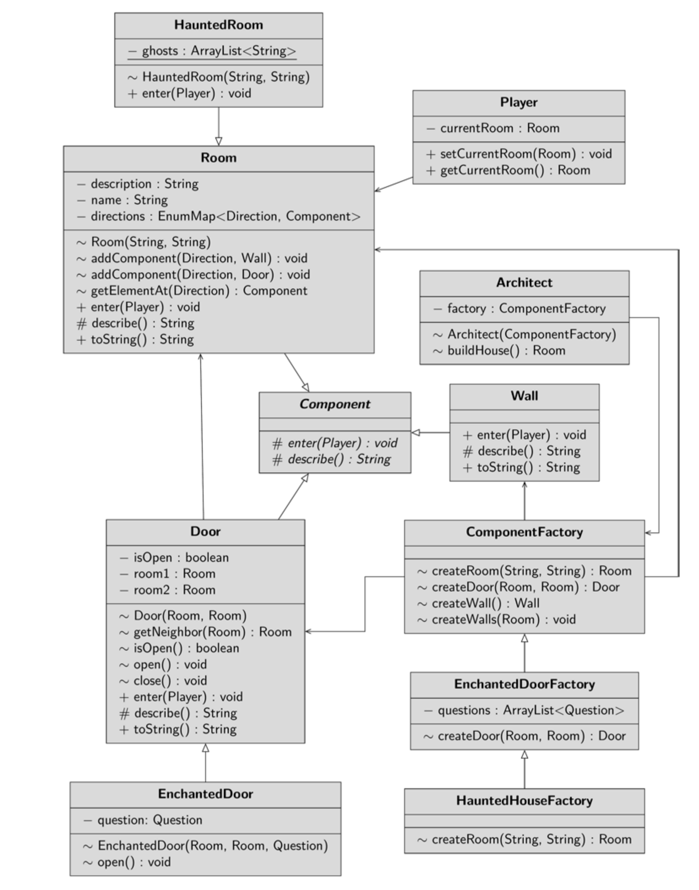

# Chasing Ghosts
Imagine you get the order to create a game in which you have to hunt ghosts and open 
magic doors in an old house. Remember the old text adventures(A text game or text-based game is an electronic game that uses a text-based user interface, that is, the user interface employs a set of encodable characters, such as ASCII, instead of bitmap or vector graphics) that were popular in the 
early days of home computing and still have fans today? We’re doing something similar.

## The First Version
The frst version you create should be quite simple. You have a house created and explore 
it with a few simple commands. The commands you enter will be marked with the greater 
than sign, which should appear after the description of the game situation
<pre>
 You are in the hallway
 You see
    to the North: a closed door
    to the South: a wall
    to the West: a closed door
    to the East: a wall
 > open door west
 The door will be opened
 > enter door west
 You are in the bathroom
 > look
 You are in the bathroom
 You see
    to the North: a wall
    to the South: a wall
    to the West: a wall
    to the East: an open door
 > exit
 </pre>
 The frst version has nothing to do with factories yet. It is intended to introduce you to the 
logic of the game and the approach to programming

## Second Version
The second version of the project is primarily intended to resolve the complexity of the 
class House of the frst version. The class has three tasks: It must obtain the components 
of the house, it must assemble the components, and it must provide game control. The
multiplicity of tasks violates the SRP! In fact, it should be enough for the class to know 
which room the player is currently in in order to apply the currently entered command to him.
To break the complexity, the construction process is outsourced in this version of the 
program, which you can fnd in the example project House_2. There is a class 
ComponentFactory whose task is to create rooms, new walls and new doors from the 
components.

In addition, in this program version there is the new class Architect, which knows 
the factory and gets rooms and doors from there to construct the house and assemble it 
from the individual components. If the foor plan is stored in a fle that needs to be read and 
parsed, the Architect class can become quite complex. The architect gets a reference 
to a ComponentFactory in the constructor. From this factory it gets the components 
and assembles them. Afterwards, it returns the room that you defned as the entry point.
## Third Version
New in this version is a class that defnes a door that can only be opened with a spell. When 
you try to open a door, it will ask you a question. For example, you may want to open a 
door and it will tell you to “Speak FRIEND and enter”. Of course, if you are familiar with 
the relevant literature, you will know to type mellon. The question and your answer are 
stored in the static inner class question.

The class EnchantedDoorFactory inherits from the class ComponentFactory
and only overwrites the method createDoor(). This method randomly decides whether 
a door shall be enchanted or not. In addition, the factory has the task of generating a list of 
questions. If an enchanted door is to be created, a question and the associated password are 
selected from this list.

The class EnchantedDoor inherits from the class Door and overwrites the method 
open(). To the constructor you pass both the affected rooms and the question. The rooms 
are passed to the superclass, the question is stored in a data feld
# Version 4 – The Haunted House
Our goal is to program a haunted house. There are doors that have to be opened with a spell. 
There are also some rooms where ghosts can be found. So, to program the last version, 
create the class HauntedHouseFactory, which inherits from the class 
EnchantedDoorFactory. That is, randomly create doors with spells. You apply the 
same logic again to create rooms where ghosts can randomly appear. A static data feld is used 
to store how apparitions can appear.

The factory should be able to create a room with a ghost. The class HauntedRoom
extends the class Room. When you enter the room, it is randomly decided whether the 
ghost appears or not. A static data feld stores how the apparitions can appear.

