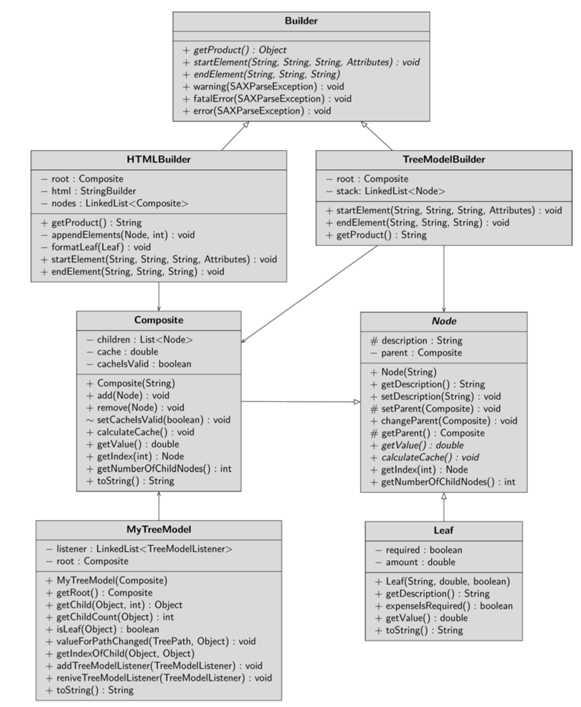

I would like to take up the budget book from the 
last chapter. To do this, open the sample project BudgetBuilder. In practice, you probably 
don’t want to store the various items and categories in the source code, as I showed you 
with the composite pattern in Chap. 12. You may want to read the data from an XML fle 
and display it in a JTree. The Builder Pattern is ideally suited for this, since a node in the 
JTree cannot be created in one pass; only when it has no further subnodes can the object 
creation be completed.

The XML shortened fle in the example looks like this:
```xml
 <?xml version="1.0" encoding="UTF-8"?>
 <!DOCTYPE Budgetbook
 [
 <!ELEMENT Budgetbook (Item*, Month+)>
 <!ELEMENT Month (Category*)>
 <!ELEMENT Category (Item| Category)*>
 <!ELEMENT Item EMPTY>
 <!ATTLIST Budgetbook description CDATA #REQUIRED>
 <!ATTLIST Month description CDATA #REQUIRED>
 <!ATTLIST Category description CDATA #REQUIRED>
 <!ATTLIST Item description CDATA #REQUIRED
 amount CDATA #REQUIRED
 required (yes|no) "yes" >
 ]>
 <Budgetbook description = "Budgetbook 2022">
 <Item description="Life insurance" amount = "-1600" required 
= "yes"/>
 <Month description = "January">
 <Category description = "Income">
 <Item description = "Main job" amount = "2000" required 
= "yes"/>
 <Item description = "Lectures" amount = "5000" required 
= "yes"/>
 </Category>
 <Category description = "Expenses">
 <Category description = "Rent">
 <Item description = "Apartment" amount = "-700"/>
 <Item description = "Garage" amount = "-150" required 
= "no"/>
 </Category>
 <Category description = "Insurances">
 <Item description = "Car" amount = "-34.50"/>
 </Category>
 </Category>
 </Month>
 </Budgetbook>
```
## Displaying XML Files treeModel
 Your task will now be to turn the XML document into a TreeModel and display it in 
a JTree.

I frst took the last project version of the chapter about the composite pattern. In this, I 
created a new package builder, where you can fnd the abstract class Builder.
Builder inherits from org.xml.sax.helpers.DefaultHandler and forces its 
subclasses to defne the startElement() and endElement() method. When an 
element of the XML document is opened or closed, one of these methods is called. If the 
XML data is not valid, the warning(), error(), or fatalError() methods emit 
appropriate error messages. The client frst lets an instance of the Builder type create an 
object and then fetches the fnished product from this instance; each subclass must there-
fore also offer the getProduct() method.

```java
 public abstract class Builder extends DefaultHandler {
 public abstract Object getProduct();
 @Override
 public abstract void startElement(String uri,
 String localName, String name,
 Attributes attributes);
 @Override
 public abstract void endElement(String uri,
 String localName, String name);
 @Override
 public void warning(SAXParseException exception) {
 System.err.println(“-> warning: “ +
 exception.getMessage());
 }
 @Override
 public void fatalError(SAXParseException exception) {
 System.err.println(“-> FATAL ERROR: “ +
 exception.getMessage());
 }
 @Override
 public void error(SAXParseException exception) {
 System.err.println(“-> error: “ +
 exception.getMessage());
 
 }
```

The frst concrete builder you will create is the TreeModelBuilder. It has two data 
felds: the root node and a list where all nodes are temporarily stored. The startEle-
ment() and endElement() methods are responsible for the actual construction pro-
cess. When an element is opened, the startElement() method frst checks if the 
element is called “Item”. If so, the attributes are retrieved and a new leaf is created; other-
wise, a new composite is created. If the root is null, that is, only for the very frst ele-
ment, the currently created element is passed to the root data feld. If the root data feld 
is not null, that is, starting with the second element, the new element is appended to the 
last composite stored in the list as a child node. The node is then stored in the list.

```java
 public class TreeModelBuilder extends Builder {
 private Composite root;
 private fnal LinkedList<Node> stack =
 new LinkedList<>();
 @Override
 public void startElement(String uri,
 String localName, String name,
 Attributes attributes) {
 Node node;
 if (name.equalsIgnoreCase(“Item“)) {
 var tempDescription =
 attributes.getValue(“description“);
 var tempAmount = Double.
 parseDouble(attributes.getValue(“amount“));
 var tempRequired =
 attributes.getValue(“required“).
 equalsIgnoreCase(“yes“);
 node = new Leaf(tempDescription, tempAmount,
 tempRequired);
 } else {
 var tempDescription =
 attributes.getValue(“description“);
 node = new Composite(tempDescription);
 }
 if (root == null)
 root = (Composite) node;
 else {
 var tempNode = (Composite) stack.peekLast();
 tempNode.add(node);
 }
stack.add(node);
 }
 // … abridged
 }
```

The method endElement() is called when the element is closed. It can be limited to 
removing the last element stored in the list there. The method getProduct() creates a 
MyTreeModel with the data feld root and returns it.

```java
 @Override
 public void endElement(String uri, String localName,
 String name) {
 stack.pollLast();
 }
 @Override
 public TreeModel getProduct() {
 return new MyTreeModel(root);
 }
```

The client frst creates a builder instance, in this project a TreeModelBuilder. It passes 
this builder to the build() method, which frst reads the XML fle, converts it into a 
string and parses it with the builder as handler.

```java
Budget() {
 var builder = new TreeModelBuilder();
 build(builder);
 var treeModel = (TreeModel) builder.getProduct();
 var frmMain = new JFrame(“Builder Pattern Demo“);
 frmMain.setDefaultCloseOperation(JFrame.EXIT_ON_CLOSE);
 var trvBudgetBook = new JTree(treeModel);
 trvBudgetBook.setCellRenderer(
 new MyTreeCellRenderer());
 trvBudgetBook.setEditable(true);
 trvBudgetBook.setCellEditor(new MyTreeCellEditor());
 var scrTree = new JScrollPane(trvBudgetBook);
 frmMain.add(scrTree);
 frmMain.setSize(500, 500);
 frmMain.setVisible(true);
}
public void build(Builder builder) {
try {
 var content = Files.readString(flePath);
 var factory = SAXParserFactory.newInstance();
 factory.setValidating(true);
 var saxParser = factory.newSAXParser();
 saxParser.parse(new InputSource(
 new StringReader(content)),builder);
 } catch (IOException | ParserConfgurationException |
 SAXException ex) {
 ex.printStackTrace();
 }
}
```

## Displaying XML Files as HTML
The following example extends the project with a new builder. It should be possible to 
generate and display the XML fle as an HTML document. Follow the necessary steps in 
the sample project BudgetBuilder_Ext. In the frst step, you create a new builder, the 
HTMLBuilder, which inherits from the Builder class. Nothing changes in the star-
tElement() and endElement() methods. The getProduct() method generates 
an HTML string from the information in the root and returns it.

```java
@Override
 public String getProduct() {
 html.append(“<html><body><h1 align=\“center\“>“);
 html.append(root.getDescription());
 html.append(“</h1>“);
 html.append(“<b>“ + “Annual items:</b><br/>“);
 for (var i = 0; i < root.getNumberOfChildNodes();
 i++) {
 var tempNode = root.getIndex(i);
 if (tempNode.getClass() == Leaf.class) {
 html.append(“ ”);
 var item = (Leaf) tempNode;
 formatLeaf(item);
 html.append(“<br/>“);
 } else {
 html.append(“<p>“);
 appendElements(tempNode, 0);
 html.append(“</p>“);
 }
 }
 html.append(“</body></html>“);
 return html.toString();
 }
```
In this method, the appendElements() method is called, which recursively tra-
verses all nodes and expands the HTML string.
```java
 private void appendElements(Node node, int tab) {
 html.append(“<br/>“);
 for (var i = 0; i < tab; i++)
 html.append(“ ”);
 if (node.getClass() == Leaf.class)
 formatSheet((sheet) node);
 else {
 if (tab == 0)
 html.append(“<b>“);
 html.append(node);
 if (tab == 0)
 html.append(“</b>“);
 }
 for (var j = 0; j < node.getNumberofChildNodes();
 j++) {
 var childNode = node.getIndex(j);
 appendElements(childNode, tab + 1);
 }
 }
```
Both methods call the formatLeaf() method, which checks an output item to see if 
it was required. If not, the display text is colored red.
```java
private void formatLeaf(Leaf item) {
 if (!item.expenseIsRequired())
 html.append(“<font color=\“#FF0000\“>“);
 double amount = item.getValue();
 html.append(item
 .getDescription())
 .append(“: “)
 .append(NumberFormat
 .getCurrencyInstance()
.format(amount));
 if (!item.expenseIsRequired())
 html.append(“</font>“);
}
```