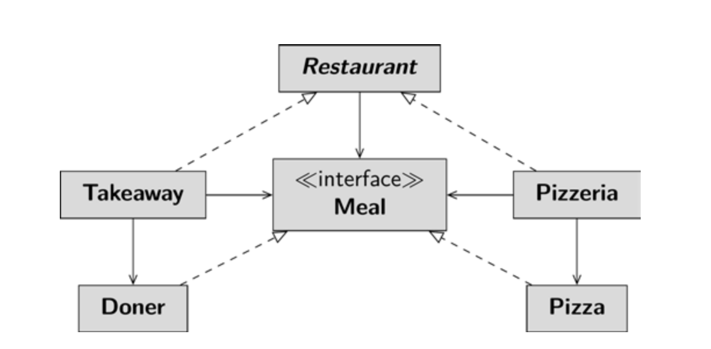

For the frst, introductory example, meals are to be prepared. Since everything is kept very 
simple at the moment, there are only the classes Doner and Pizza. Both implement the 
interface Meal. Fittingly, there is a Pizzeria and a Takeaway. Both inherit from the 
abstract class Restaurant. The abstract class defnes the order() method, which 
dictates that the guest should frst be asked for their request, then the requested meal is 
prepared, and fnally it is served. This method is called by the guest when he wants to order 
a meal. The method prepareMeal() is a factory method. Its job is to create a specifc 
product. The actual execution is delegated to subclasses, i.e. Takeaway and Pizzeria. 
Note that while the takeOrder() method is also defned by the subclasses, this is irrel-
evant to the discussion of the pattern; I intended this coding to ask the guest for their pizza 
request at the pizzeria and their doner request at the takeaway. You can fnd the complete 
code in the sample project Meal.

```java
public abstract class Restaurant {
 protected abstract String takeOrder();
 protected abstract Meal prepareMeal();
 private void serveMeal(Meal meal) {
 System.out.println(“Meal is here! It’s “ + meal);
 }
 public fnal Meal order() {
 var order = takeOrder();
 var meal = prepareMeal();
 serveMeal(meal);
 return meal;
 }
 }
```
Takeaway and pizzeria create either a doner or a pizza – each varied according to customer preferences. All meals implement the same interface. The guest – in the example the 
test class – creates the instance of a subclass of the class Restaurant and calls the method 
order() on it.
```java
 public class Test {
 public static void main(String[] args) {
 Restaurant mammaMia = new Pizzeria();
 mammaMia.order();
 Restaurant istanbul = new Doenerbude();
 istanbul.order();
 }
 }
```


In the terminology of the pattern, the interface Meal is a product. The derived classes Doner and Pizza are concrete 
products. The interface Restaurant is a producer and the concrete localities (pizzeria 
and takeaway) are concrete producers.

The factory method can optionally be parameterized. The project is already prepared for 
this variation. The method takeOrder() returns a string with the order. The previous 
project version ignores the customer request, which is not very friendly. In the new ver-
sion, the order is passed to the factory method as a parameter, which then creates the 
desired meal. The pizza example demonstrates this procedure. The following code from 
the MealVariation sample project shows the parameterized factory method of the pizzeria.
```java
 protected Meal prepare(String order) {
 if (order == null || order.isEmpty())
 return new Pizza();
 else
 return switch (order) {
 case “Calzone“ -> new Calzone();
 case “Hawaii“ -> new Hawaii();
 default -> { System.out.
 println(“We don't offer this pizza!“);
 yield null;
 }
 }
```
With a parameterized factory method, you can easily introduce new products. Without 
parameters, you would have to rely on creating a new concrete producer for each new 
concrete product. However, since the production effort for the different pizzas is similar 
and calzone even inherits from pizza, it makes sense to parameterize the factory method.