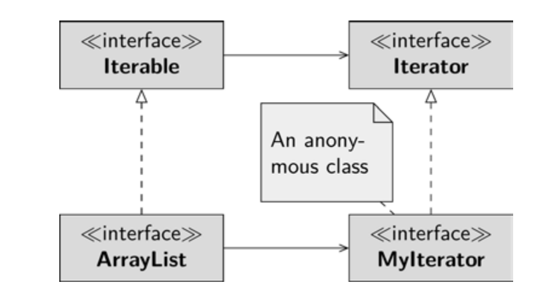

 To use a collection in an extended for-each loop, it must 
implement the Iterable interface. The interface prescribes the iterator() method, 
which returns an object of type Iterator. The Iterable is implemented by the 
ArrayList class, for example, but the two collections you created in the Iterator Pattern 
chapter also have this interface implemented. All of these classes must be able to return a 
product, an object of type Iterator; the Iterator prescribes three methods that you can 
use to iterate element-by-element through the collection. In most cases, it might be conve-
nient to defne the iterator as an anonymous class, that is, return new Iterator{...}. 

he diagram in Fig. 16.2 shows this interaction.
You defne an interface, the Iterable interface, which prescribes a method for creating objects: iterator(). This method is the factory method. An object of the type of 
the interface Iterable must return an object of the type Iterator, which works 
together with its own specifcation. In the diagram, I have helpfully named this object MyIterator

The factory method pattern is useful when you want to write general-purpose code. A for-each loop, which I mentioned in the last example, has no idea from which class the object of type Iterable was instantiated  – it doesn’t even need this knowledge. 

Similarly, the for-each loop has no interest in which concrete product it is working with. Since the binding of the concrete iterator object to the for-each loop is very loose, you can defne any collection classes and use them in the for-each loop. The concrete creator is responsible for creating a matching concrete product.

If you create a new object with the new operator, you must always call a constructor of the class. When you defne a factory method, on the other hand, you can choose any identifer you want