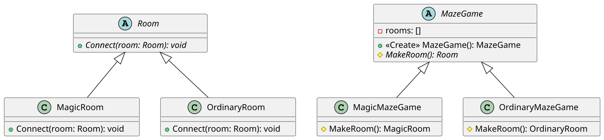

This Java example is similar to one in the book Design Patterns.

The MazeGame uses Room but delegates the responsibility of creating Room objects to its subclasses that create the concrete classes. The regular game mode could use this template method:

public abstract class Room {
    abstract void connect(Room room);
}

public class MagicRoom extends Room {
    public void connect(Room room) {}
}

public class OrdinaryRoom extends Room {
    public void connect(Room room) {}
}

public abstract class MazeGame {
     private final List<Room> rooms = new ArrayList<>();

     public MazeGame() {
          Room room1 = makeRoom();
          Room room2 = makeRoom();
          room1.connect(room2);
          rooms.add(room1);
          rooms.add(room2);
     }

     abstract protected Room makeRoom();
}
The MazeGame constructor is a template method that adds some common logic. It refers to the makeRoom() factory method that encapsulates the creation of rooms such that other rooms can be used in a subclass. To implement the other game mode that has magic rooms, the makeRoom method may be overridden:

public class MagicMazeGame extends MazeGame {
    @Override
    protected MagicRoom makeRoom() {
        return new MagicRoom();
    }
}

public class OrdinaryMazeGame extends MazeGame {
    @Override
    protected OrdinaryRoom makeRoom() {
        return new OrdinaryRoom();
    }
}

MazeGame ordinaryGame = new OrdinaryMazeGame();
MazeGame magicGame = new MagicMazeGame();