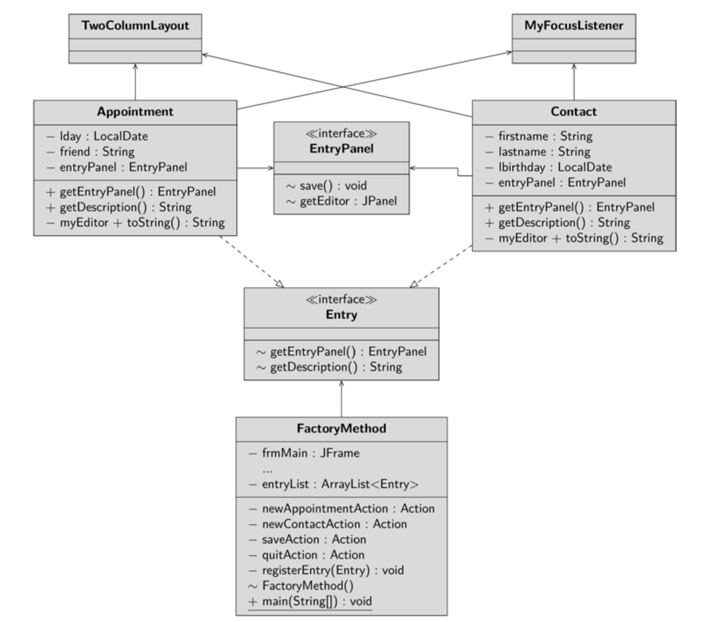

You create a framework that manages appointments and contacts. 
The frame of the program provides a blank interface and the menu. You can create 
entries (appointments and contacts). If you have created a new entry, it will be displayed on 
a new tab. The program should remain fexible to be able to display new entries such as 
e-mails or entire address books in a further expansion stage. You can guess that it’s all about 
the frame and the entries being separated from each other and having only loose interfaces.
Let’s take a closer look at the connection between the frame and the entry. Entries are 
certainly responsible for their own data. A contact consists of frst and last name and a date of birth. An appointment consists of the name of the other participant and the date of the 
appointment. The question now is which entity composes the controls for each data. If you 
delegate this task to the frame, this assumes that the frame knows all the dates of all con-
ceivable entries. You are restricting yourself in that an existing entry may not get any 
additional data, because otherwise the frame would have to be modifed. Also, implement-
ing new entries would be extremely costly because the new controls would have to be 
coded in the frame. However, the frame has already been extensively tested and delivered 
to the customer – you will never want to touch it again under any circumstances. So the 
responsibility for designing the editor must be delegated to the class that best knows the 
controls you need: the entry itself.
