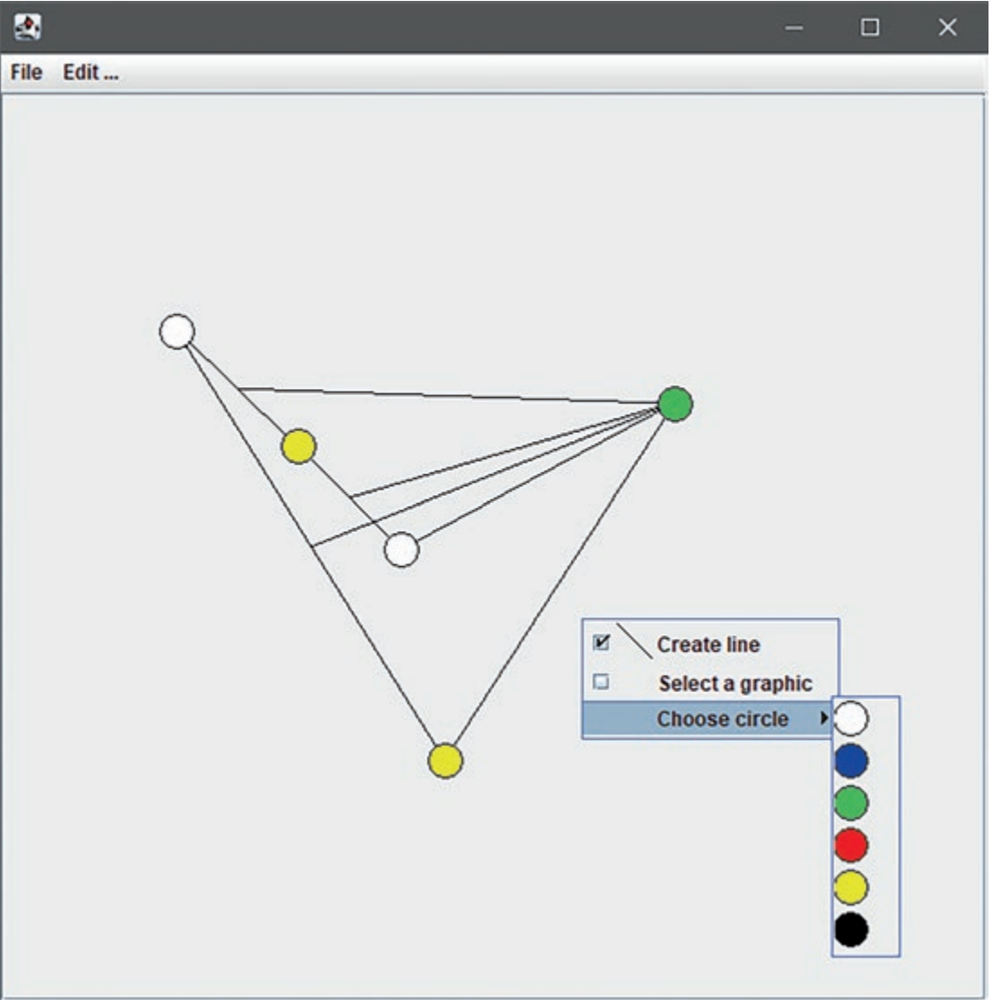
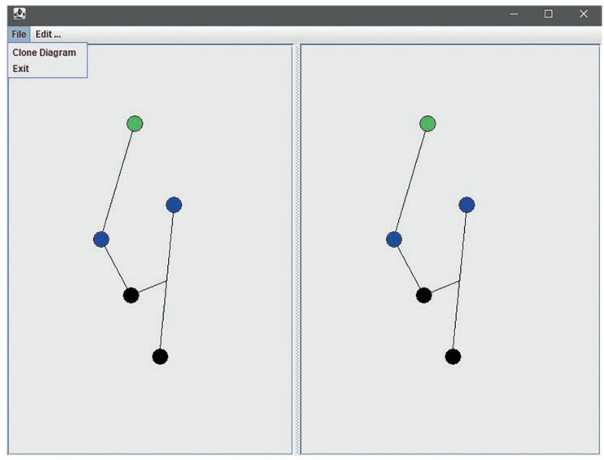
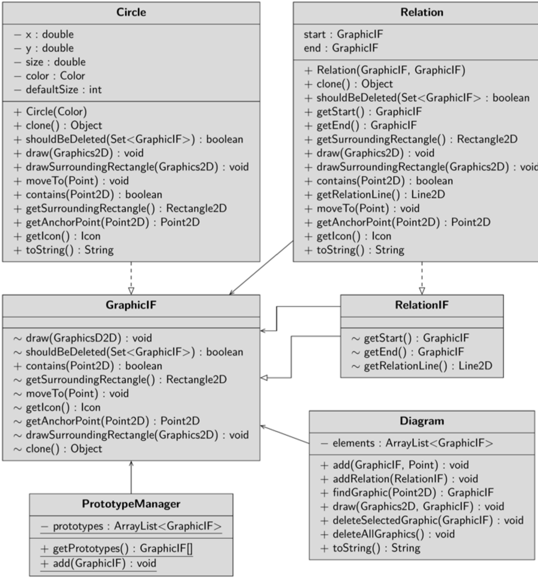
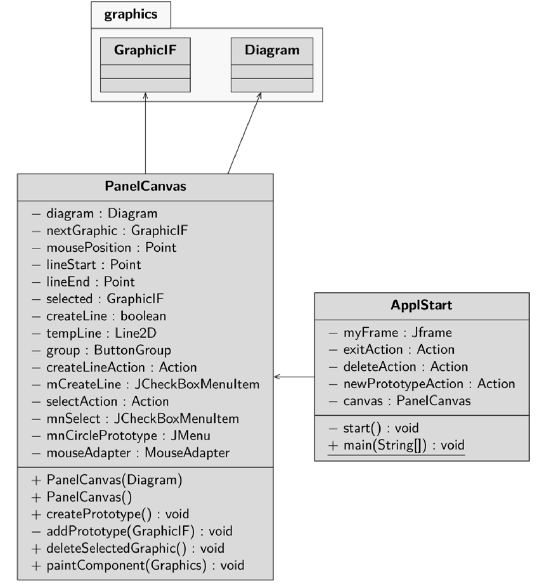

You draw different colored circles and connect them with lines. Both circles and lines are 
graphics. You can delete both circles and lines. Lines that no longer connect two graphics 
after deletion are also deleted

# First Version
Right-click to open the context menu and choose to either draw a line or add a circle or 
select a graphic. You have different circles at your disposal: red, blue, green and so on. If 
you choose to draw a line, click either a circle or a line and drag a line to the target graphic, 
which can also be either a line or a circle. If you select Select a graphic, you can select 
either a circle or a line. Once you have made a selection, choose “Edit…” and “Delete 
selected” from the main menu. The selected graphic will then be deleted, with all affected 
connections – lines – also being deleted. If you have selected a circle, you can also move it.

You can model the highway network of Germany, the metro map of Paris or whatever 
with this version of the graphics editor. In further expansion stages, you could add boxes 
in addition to circles and turn the framework into a small UML editor

PanelCanvas class, there. The PrototypeManager class creates the prototypes of 
the circles to be drawn. In practice, this class can grow to any size; extensive initialization 
routines to create the prototypes are offoaded there. The class Diagram is the data model 
of the editor. Here, the graphics are stored and managed in a list. The interface GraphicIF
defnes methods that must be implemented by all graphics (circles and lines). The interface 
RelationIF, which is derived from this, describes methods that only have to be imple-
mented by lines. The Circle and Relation classes implement these interfaces and 
defne the prescribed methods. For example, each graphic must be able to describe the 
rectangle enclosing it and store a specifc color and its position. Perhaps most importantly, 
a graphic must be able to draw itself and, most importantly, clone itself. Lines always con-
nect two other graphics, so they must also be able to store and return the start and end 
graphics.

The diagram is drawn on the PanelCanvas. The MouseAdapter overrides some 
EventHandlers. The PanelCanvas also defnes some actions: The Create_Line_Action sets 
a fag that a line should be drawn. The Select_Action specifes that a graphic can be 
selected. The actions are passed to JCheckBoxMenuItem instances and hooked into the 
panel’s context menu. The actions are combined into a ButtonGroup so that only one can 
be selected at a time.

```java
private fnal ButtonGroup group = new ButtonGroup();
 // … abridged
 group.add(mnCreateLine);
 group.add(mnSelect);

```
 In the constructor, the prototype circles are also created as menu items. First, the proto-
type manager queries all prototypes. Then a separate menu item is created iteratively for 
each prototype; when called, the prototype is passed to the data feld nextGraphic.

```java
 public PanelCanvas(Diagram) {
 // … abridged
 for (fnal GraphicIF tempGraphic :
 PrototypeManager.getPrototypes())
 addPrototype(tempGraphic);
 // … abridged
 }
 // … abridged
 private void addPrototype(fnal GraphicIF prototype) {
 fnal var drawAction = new AbstractAction() {
 @Override
 public void actionPerformed(ActionEvent event) {
 createLine = false;
 nextGraphic = prototype;
 }
 };
 var mnNewGraphic = new JCheckBoxMenuItem(drawAction);
 mnCirclePrototypes.add(mnNewGraphic);
 group.add(mnNewGraphic);
 var icon = prototype.getIcon();
 mnNewGraphic.setIconTextGap(0);
 mnNewGraphic.setIcon(icon);
 }
```

If you have selected a circle and click on the drawing area, the event handler mouse-
Clicked is called, which requests the prototype from the data feld nextGraphic,
clones it and saves the clone in the diagram.

```java
@Override
 public void mouseClicked(MouseEvent event) {
 mousePosition = event.getPoint();
if (nextGraphic != null)
 try {
 var newGraphic = (GraphicIF) nextGraphic.clone();
 selected = newGraphic;
 diagram.add(newGraphic, mousePosition);
 } catch (CloneNotSupportedException ex) {
 new ErrorDialog(ex);
 }
 else
 // Search for a graphic object
 // at the mouse position and select
 selected = diagram.fndGraphic(mousePosition);
 repaint();
 }
```

# The Second Version – Deep Copy
In the second version (sample project GraphEditor_2) it should be possible to clone the 
whole diagram. Two canvas instances are placed on the JFrame. If you click on Clone 
Diagram in the File menu item, the diagram is copied from the left side to the right side. 
You can now modify both diagrams independently. 


The menu item is defned in the ApplStart class and hooked into the menu. It que-
ries for the diagram at the left panel and inserts it at the right panel. The PanelCanvas
class defnes the getDiagramAsClone() method in this version. First, the 
ByteArrayOutputStream baos is created and passed to the ObjectOutputStream 
oos. Into the baos the diagram is serialized. Then you create the ByteArrayInputStream 
bais. The data of the baos is passed to this. The bais is passed to the ObjectInputStream 
ois, which deserializes the serialized diagram. The resulting object is cast to a diagram 
and returned. Serialization and deserialization cause the objects, including the objects they 
reference, to be independent of each other.

```java
 public Diagram getDiagramAsClone() {
 Diagram clone = null;
 try {
 this.nextGraphic = null;
 this.selected = null;
 this.createLine = false;
 ObjectOutputStream oos;
 ByteArrayInputStream bais;
 ObjectInputStream ois;
 try ( var baos = new ByteArrayOutputStream()) {
 oos = new ObjectOutputStream(baos);
 oos.writeObject(diagram);
 bais =
 new ByteArrayInputStream(baos.toByteArray());
 ois = new ObjectInputStream(bais);
 clone = (diagram) ois.readObject();
 }
 oos.close();
 bais.close();
 ois.close();
 } catch (IOException ex) {
 new ErrorDialog(ex);
 } fnally {
 return clone;
 }
 }
```

# Version 3:Defining Your Own Prototypes
A special feature of the Prototype Pattern is that you can develop and add your own proto-
types at runtime. There is a new menu item New Prototype 
in the Edit menu. When you select this menu item, a color selection dialog appears. Select 
a color and click Ok. A circle with the desired color is now available as a prototype in the 
context menu. In the class ApplStart the action newPrototypeAction is defned, 
which calls the method createPrototype() on the drawing area. Within the method 
a JColorChooser is called. With the return value a new circle is created and added as pro-
totype to the context menu as well as to the prototype manager.


 
```java
 public void createPrototype() {
 var newColor =
 JColorChooser.showDialog(PanelCanvas.this,
 “New Circle“, Color.cyan);
 if (newColor != null) {
 GraphicIF newPrototype = new Circle(newColor);
 addPrototype(newPrototype);
 PrototypeManager.add(newPrototype);
 }
 }
```
