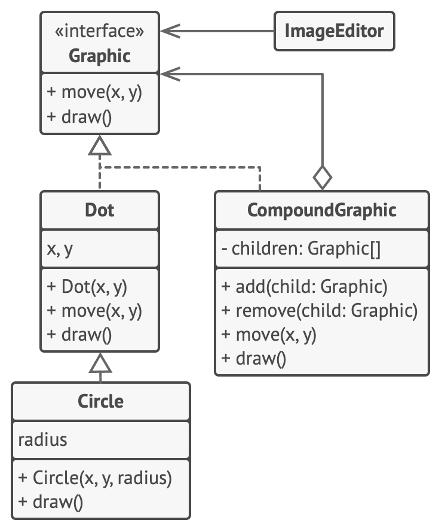

This example shows how to create complex graphical shapes, composed of simpler shapes and treat both of them uniformly.

https://refactoring.guru/design-patterns/composite/java/example

In this example, the Composite pattern lets you implement stacking of geometric shapes in a graphical editor.

The CompoundGraphic class is a container that can comprise any number of sub-shapes, including other compound shapes. A compound shape has the same methods as a simple shape. However, instead of doing something on its own, a compound shape passes the request recursively to all its children and “sums up” the result.

The client code works with all shapes through the single interface common to all shape classes. Thus, the client doesn’t know whether it’s working with a simple shape or a compound one. The client can work with very complex object structures without being coupled to concrete classes that form that structure.